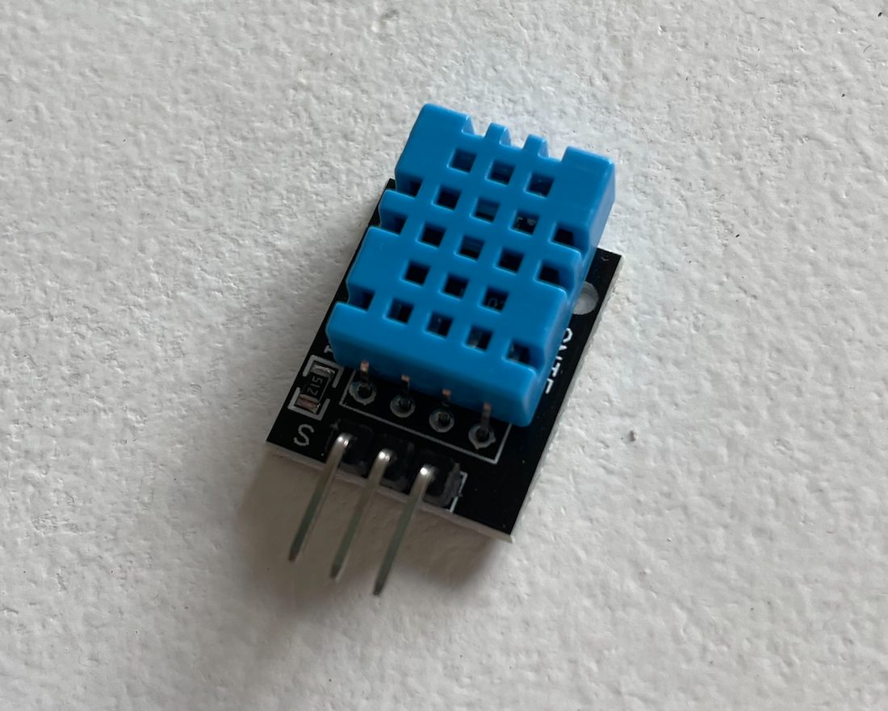
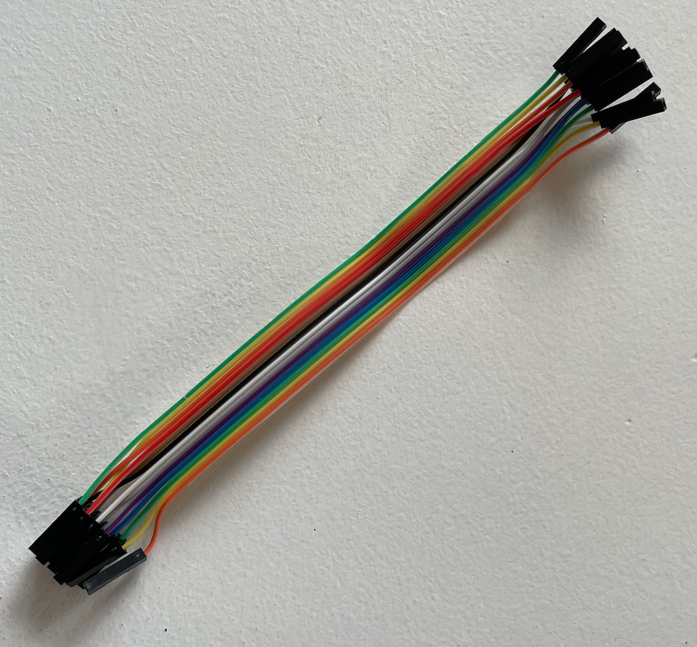

### Temperature and humidity project

Sanna Doolk, sd222si

This is a project to set up an API that gets data from a sensor connected to an ESP32 microcontroller. The sensor is an DHT11 that measures temperature and humidity. The data from the senor is saved in InfluxDB and InfluxDB is the queried by an express application to get the saved results. The data is then presented in a React application.  

Hur lång tid???

### Objective

I have chosen this project because IoT-projects and hardware is completely new for me, and a temperature/humidity sensor together with an ESP32 seemed like a good way to start learning. 

The purpose of this project is to have a way to measure temperature and humidity and then be able to observe the result via an interface in an application. This could be useful for example if you want to keep track of the temperature/humidity in your house when you’re not home, in a greenhouse or somewhere else where this could be important. 

Personally I think this project will ge me more insights in how IoT-projects actually work and will inspire me to make other project that are a bit more complicated and more complex in the future. As for right now I feel like the most important thing for me is to learn more and understand the flow of how these things work, as I have no earlier experience of it. 

### Material

* ESP32 WROOM 32D Microcontroller (Amazon 2pcs 159kr) 

In this project I have chosen to work with the ESP32 development board since this was recommended in the course plus it seemed suitable for this project after research online. ESP32 has built in wifi and bluetooth and can be connected to for example sensors to be able to do something with the sensor data with help from code uploaded to the microcontroller. 


 
* DHT11 sensor module (Electrokit) (Sensor kit 25 modules, 239 kr)

I bought a kit with different sensor modules and chose to work with the DHT11 sensor. The sensor measures the temperature in the air where it’s located as well as the humidity and returns the values. It has a built in 1k resistor. 



* Wires (Electrokit 23kr) 

The wires are used to connect the sensor with the microcontroller. In this project I needed three wires to connect the sensor. The type of wire I used was female - female since I did not use a breadboard (because it did no work for me). If a breadboard is used to connect the microcontroller with the sensor, three male - female wires would be needed instead. 



### Computer setup

I have chosen to work in Arduino IDE.

### Steps to get started:

* Install the latest version of Arduino IDE on your computer via https://www.arduino.cc/en/software 
* Open the IDE and go to Arduino - preferences 
* Copy the link ”https://dl.espressif.com/dl/package_esp32_index.json" in the field ”Additional Boards Manages URLs” and click on ’OK’
* Go to Tools - Board - Boards manager 
* Search for “ESP32 by Espressif Systems“ in the search field and install it

### Connect the ESP32:

* For Mac I had to install drivers via https://www.silabs.com/developers/usb-to-uart-bridge-vcp-drivers 
* *onnect the ESP32 via USB
* Go to Tools - Board and chose the name of the ESP32 that us connected
* Go to Port and chose the port the ESP32 is connected to 

### To test if things work:

* Go to File - Examples - Wifi and chose ’Wifiscan’
* Click on ’Upload’ arrow to upload the example scan (in my case I had to press the Boot-button on mys ESP32 to make the uploading it work) 
* Go to Tools and click on Serial Monitor
* If everything is working, the monitor should start scanning available wifi:s and print them in the serial monitor 

### Putting everything together

The sensor is connected to the ESP32 microcontroller like so:

* Signal (to the right from the front) - GPI032 pin 

* Power line (middle) - 3V3

* Ground (to the left from the front) - GNP 

Since the sensor module has a built in resistor no extra restore is needed in this case. However if the DHT11 sensor is not of the type module, a resistor might be needed.


### Platform

I have used the time series database InfluxDB as my platform in this project. I have been using a free subscription of InfluxDB cloud. 

### The code

```python=
#include <Wire.h>
#include "DHT.h"
#include <InfluxDbClient.h>
#include <InfluxDbCloud.h>
#include <WiFiMulti.h>
```

Some libraries are needed to make this code work. Before running the code go to Tools - Board - Boards manager in Arduino and search for ESP8266 Influxdb by Tobias Schurg (also works for ESP32) and install it. A library for the DHT11 sensor is also needed. Search for DHT sensor library by Adafruit and install it. They then need to be included in the code as above, as well as library for connection to wifi. 

The code also needs to know what kind of device is used and what type of sensor since the libraries works for more than one kind. The GPI0-pin the sensor is connected to also needs to be specified. 

To be able to connect to wifi some credentials such as wifi_ssid and wifi-password needs to be included as well as credentials from influxdb. To sign up and get the credentials from influxdb do as follow: 

* Go to https://cloud2.influxdata.com/signup and sign up for an account
* Choose where to store the data (Google cloud for this project), your region and enter a company name
* Select a payment plan (free for this project)
* Click on Arduino as your client library
* Create a new bucket and give it a name and select for how long the data should be stored 
* Scroll down to ’Initialize the client’ and save the credentials for INFLUX_URL, INFLUX_ORG and INFLUX_BUCKET.
* Go to the arrow in the meny and then ’Api-tokens’
* Go to ’Generate api token’ and click on ’All access api token’, save the api-token you’re getting 


```python=
#define WIFI_SSID ”…”
#define WIFI_PASSWORD ”…”
#define INFLUXDB_URL ”…” 
#define INFLUXDB_TOKEN ”…”
#define INFLUXDB_ORG ”sd222si@student.lnu.se"
#define INFLUXDB_BUCKET ”Esp32-1dv027_2"
```

This part creates a new instance of an influxdb client, this is where the credentials from our influxdb account is needed.

```python=
InfluxDBClient client(INFLUXDB_URL, INFLUXDB_ORG, INFLUXDB_BUCKET, INFLUXDB_TOKEN, InfluxDbCloud2CACert);
```

The code will then connect to wifi and start the sensor. A point of data that consists of different tags that will hold data in key - values pairs that will be saved, will need to be created as well. It then uses the client created before to connect to influxdb.

After that the code will start a loop in where the sensor reads the temperature and humidity, creates fields for those and save them in influxdb. This loop will run every 10 second. 

```python=
void loop() {
  sensor.clearFields();

// Read and add the values from the sensor
  humidity = dht.readHumidity();
  temperature = dht.readTemperature();

  sensor.addField("Temperature",temperature);
  sensor.addField("Humidity",humidity);

  Serial.print("Writing: ");
  Serial.println(client.pointToLineProtocol(sensor));

  // Check that there is a wifi signal
  
  if (wifiMulti.run() != WL_CONNECTED) {
    Serial.println("Wifi connection lost");
  }

  if (!client.writePoint(sensor)) {
    Serial.print("InfluxDB write failed: ");
    Serial.println(client.getLastErrorMessage());
  }
  Serial.println("");
  Serial.println("Delay 10 seconds");
  delay(10000); // Writes the point to the db every 10000 millisecond
}  
```


### Data flow / Connectivity

The data is being sent using wifi and is sent every 10 second.

The sketch uploaded to the ESP32 includes code for connecting to wifi, reading the sensor and writing the sensor data to influxDB every 10 second.

The steps are as follow:

* Connect to wifi
* Read sensor values
* Connect to Influxdb 
* Write sensor values to Influxdb
* Sensor values are save in Influxdb
* (Repeats every 10 second)
* The client application sends a GET-request to retrieve the sensor values to the Express server application 
* The server application perfumes a query using the Flux language to retrieve the wanted sensor values from influxdb 
* The server application sends back the query response to the client application 
* The client application shows the retrieved data 

### Presenting the data

Bilder

The database I’m using to save the data is InfluxDB and it is saved there for 14 days. The data should be written to the database every 10 second, however I have noticed that sometimes the time intervals differs a bit, perhaps due to temporary wifi loss. 

### Finalizing the design

Bilder applikationen 

Video applikationen 

The final result of the project is a React application showing the latest measured temperature and humidity value. It also possible to see charts over how the temperature and humidity values have changed over the last hours.

I had a hard time getting the hardware to work, with everything from connecting the ESP32 to getting the sensors to work. Unfortunately I spent a lot on time on this, time I rather would have spent on the project itself. It was hard for me to know why things didn’t work and what to do to solve it since I didn’t have any prior experience in working with hardware like this. 

I chose to keep the project simple and not complicate things to much because of this, but of course there are more things I could do to keep developing my project, for example more complex queries to show data in different ways. Perhaps I also could have implemented real time updates and so on.

Although after doing this project I feel like I know a bit more and I understand the flow better. I feel like there is a lot more I could do to keep developing my project as well as making other projects, and I hope there will be time for that in the future. 
